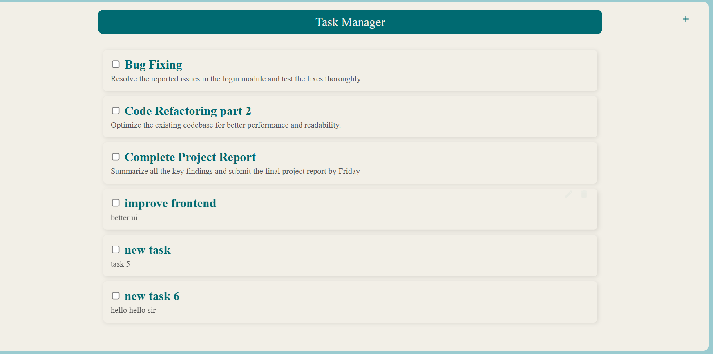

# Task Management API

This is a Node.js and Express API for managing tasks with CRUD operations.

## 🚀 Features
- Add, update, delete, and retrieve tasks.
- Mark tasks as completed or pending.
- Uses MySQL for database storage.

---

## 📌 **Installation & Setup**
1️⃣ Clone the Repository**
git clone https://github.com/your-repo/task-manager.git
cd task-manager

2️⃣ Install Dependencies
npm install

3️⃣ Setup Environment Variables
Create a .env file in the root directory and configure it with: 
PORT=8000
DB_HOST=your-database-host
DB_USER=your-database-user
DB_PASS=your-database-password
DB_NAME=your-database-name

4️⃣ Start the Server
npm start

📡 API Endpoints

POST /task
Request Body: 
{
  "title": "New Task",
  "description": "Task details"
}

Response:
{
  "_id": "67890",
  "title": "New Task",
  "description": "Task details",
  "completed": false
}

3️⃣ Update a Task

PUT /:id
Request Body:
{
  "title": "Updated Task",
  "description": "Updated details",
  "completed": true
}

Response:
{
  "message": "Task updated successfully"
}

4️⃣ Delete a Task

DELETE /:id
Response:
{
  "message": "Task deleted successfully"
}

🛠 Testing the API

1️⃣ Using Postman
Import the API collection in Postman and send requests to the endpoints.
Example:
Method: POST
URL: http://localhost:8000/task
Body:
{
  "title": "My Task",
  "description": "Details here"
}
Click Send and check the response.

 => This is the basic task management UI
=> To add new task put title and description then click on add button 